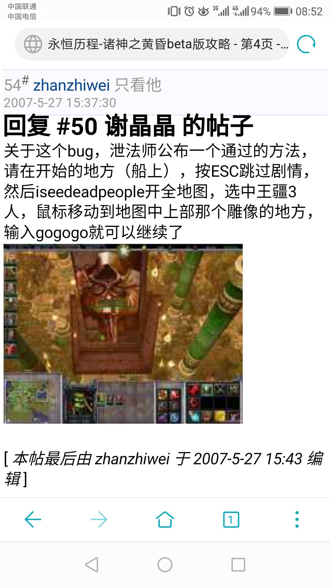

# 《永恒历程-诸神的黄昏》攻略   

<u>**请用1.20E版本进行游戏。若用1.24E，在2-3出现黑屏问题。**</u>

## 目录
  - [目录](#目录)
  - [常见bug](#常见bug)
  - [小屋加点说明](#小屋加点说明)
  - [1-1：温州外国语学校的一天（恶搞版）](#1-1温州外国语学校的一天恶搞版)
  - [1-1：决裂](#1-1决裂)
  - [1-2：王疆的历程](#1-2王疆的历程)
  - [1-3：心灵之战](#1-3心灵之战)
  - [1-4：交织的谜团](#1-4交织的谜团)
  - [2-1：不安](#2-1不安)
  - [2-2：复仇的愤怒](#2-2复仇的愤怒)
  - [2-3：与DarkShine的首次交锋](#2-3与darkshine的首次交锋)
  - [2-4：新仇与旧恨](#2-4新仇与旧恨)
  - [3-1：罗纳尔的风情](#3-1罗纳尔的风情)
  - [3-2：曙光重现](#3-2曙光重现)
  - [3-3：苏醒的邪恶](#3-3苏醒的邪恶)
  - [3-4：生命之战](#3-4生命之战)
  - [4-1：叛离的痛楚](#4-1叛离的痛楚)
  - [4-2：七神器](#4-2七神器)
  - [4-3：末日之役](#4-3末日之役)

## 常见bug
1. 若在关卡最后以变身药水的状态过关，下一关该英雄消失，变成你上关结尾变的野兽
2. 读档后小屋施法者的闪电技能会消失。（原因未知，版本1.24E, 1.20E均有此问题）
3. 变身噩梦之龙和精灵龙后，可以地图到处飞，坏处是一不小心触发了剧情，导致游戏流程的bug；好处是无敌的门可以穿过。
4. 铠甲最高lv4，拥有后再升级会消失。
5. Q: 不知道从哪一关开始，我的小地图一片黑暗，怎么都亮不起来，过了几关了也是黑的，怎么办？  
A: 小地图变黑的问题我没有遇到过，输入reset试试看

## 小屋加点说明
攻击每级+40，防御每级+2。  
小屋技能：1级医疗波、2级践踏大地、3级巫毒、4级海浪、5级闪电

## 1-1：温州外国语学校的一天（恶搞版）  

游戏开始时，控制移动的小精灵停止，否则它会自动走向蔡中正。输入“黄河大合唱”（不带引号），就可以选择三个隐藏英雄。

开始点是2楼。点击姜南忆，选择不给钱，打一架；给钱，金币-200。

要注意，在1楼/小卖部/教室之间传送时，需要一个一个英雄传送，最好不要三个英雄框选在一起传送，否则可以会卡循环传送bug导致电脑死机。

1. 语文课：前往1楼找方老师。ta让你去2楼摧毁三座炮塔并拾取物品。第三座塔掉落方老师的语文课本，捡取后传送回语文教室并打败方老师。无法再次回到三塔处。
2. 数学课：多波敌人进攻，保护治疗之泉，旁边商店可以买经验书。
3. 体育课：投篮关卡分数80以上有奖励：姜南忆的恐怖嚎叫磁带。
4. 英语课：阵地战，平推过去。

### 支线任务
1. 张弛的请求：  
游戏开场打完姜南忆以后，教师里面有一位同学叫张弛，点他，帮他找语文书。语文书在做完语文课主线任务的最后，塔被消灭后掉落。语文书给张弛，金币+2000。  
1. 在前往一楼和小卖部之前的右边有一条通道，走过去遇狮鹫骑士，回答三个问题，答案分别是：姜南忆、王疆、无职位，回答错误直接死亡。隐藏NPC在小卖部中，破坏掉一个木箱后出现
2. 打倒张伊迪：  
语文课做任务过程（语文课结束后无法接任务），走到一个方螺旋形的中心，出现支线任务，按F9查看，然后输入“打倒就打倒”，消灭敌方NPC（黑暗游侠mod），掉落林双婷的BT眼镜。
4. 挖宝：  
在语文教室内的右下角有一只小鸡，点它。开始挖宝，宝藏位置好像是随机的。挖到后出现朱老师，战胜朱老师，获得物品，混沌帝龙的卡片，效果全属性+15，以及闪电链技能。

## 1-1：决裂
建议选择：陈瑜亮（剑圣）、朱希同（圣骑士）  
隐藏英雄秘籍：尸王的眼睛圆又圆（在第一次选择英雄之前输入，可选刘英林-大法师、姜南忆-血魔法师之中的1人）

### 小屋加点：  
zhanzhiwei建议把技能点到3级，4－5没必要。1级医疗波一定要点，3巫毒在逃命和打BOSS的时候很有用。复活建议多点几次。攻击先加3级（+120），蔡中正有3级吸血光环，攻击高了不容易挂，由于存在bug，要留2点木材等两个跟随的英雄都加入再加第4级攻击。防御升1级只+2防御，没必要加。  
（Majbearclaw：我建议点满小屋技能，其它全点复活，最保守的打法。）

躲避刘英林，很简单，不要管面前的怪，一路冲过去，冲过两批怪就没问题了.

得到2号英雄后，过传送门在左上方有个巨大的血浴蜘蛛掉落治疗守卫。

得到3号英雄后，上坦克。

到达右下角桥先不要过去，顺着另一条路(路上有领主类生物)走到底会传送到隐藏区域，消灭麦哥瑟里登（9500HP75英雄型甲），掉飞雪牌棒冰*10（消耗75MP，冻敌人10s，售价200g）。
### tips:  
选了恶搞，然后玩完后再在自定义战役那里直接选决裂也是可以的，若你在第一章有神器没拿，但你已经玩到第4章时，不必担心重玩一次，只要你再玩一次第1章，拿到神器后就算不过关，直接退出，数据也会保留到以后关卡。
## 1-2：王疆的历程  
<u>__(本关达到指定流程前，别攻击冯勤夫家里面的牢笼，否则无法完成可选任务2)__</u>

王疆的傻笑只降低敌人护甲，无伤害。一级必点锁链且以后优先点锁链

出门建议选轰炸机，自行车比较差（除非你为了自虐），301公路车有时候会被卡住，比较麻烦。选好往右走，有个麦迪文，他会跟着你（可选任务1）。一路杀过去，最后2条路选右边的好打。你通过传送门之后麦迪文会自动传送到你所在的新位置，不用担心他不会跟过来。

迎战摊主（憎恶mod）了，先用轰炸机强行打他一下，然后再进门。摊主会眩晕你，用小屋施法者的技能+王疆的锁链消灭。对话尽量不要跳过，有BUG可能会使剧情无法继续。

之后是5分钟之内到学校。可以向左下角走直线送完老头完成可选任务1。5分钟结束后此任务无法完成。消灭兽族步兵开第一扇门，消灭一群牛头人后开第二扇门。这两波最好用小屋施法者技能直接消灭。接着吸引老人站在深蓝色极冰地形上完成任务获得死亡之袍（生命恢复降低，主动技能：死亡一指）。

一路王疆锁链冲过去，血不够了用小屋的无敌。半路上有个房间，里面有鞋子lv1和一瓶迅猛兽变身药。进入传送门之前用群体锁链定住追你的敌人，否则他们会追着你进入传送门并在过场动画你不能操作时攻击你。

进了教室后主线为去找2个队友。

先去地图下方的那个金矿，会发现几个农民在唱歌（可选任务2）。然后上去找侍僧。之后回去找金矿，发现门票任务，去地图上部动物园的隐藏内部找管理员（复仇天神），然后让你找羊，去右上角中间冯勤夫家后院A笼子（他家后院再后面有个亡灵巫师，边上有迅猛兽变身药），让羊回去，捡门票，给金矿那边，+50000g。

给王疆买装备法杖、袍子、鞋子，全部升到5级，再买霜冻之球（攻击+66）。

冯勤夫要校徽，回教室到右面找曹若曦，很好打（也可以选择给**）。把校徽放在冯勤夫身上，他就加入了。给冯勤夫买法仗、铠甲、鞋子并升到满级<u>__（铠甲不能升5级，否则会消失。因此铠甲最高4级）__</u>，再买个霜冻之球。在1-4开局冯勤夫会获得专属道具无法丢弃。

去右上角找丁维贤（雷克萨mod）做可选任务3，在场地的左下角拆个控制杆，开始对战。完成后得到99个消耗品CDkiller，效果为非战斗状态下加快恢复速度，以及技能直接冷却（在某些关卡CD killer和变身药水是会失灵的

杀羊捡花（小羊1朵boss羊5朵）99朵，带花去右边传送法阵处，过关。

许力可以装备法杖、袍子、鞋子。

## 1-3：心灵之战  

蔡中正往左下角走，可以捡2瓶5级变身药，但捡了要打一仗。左下角有个无作用的传送门。
第2英雄和第3英雄交战后（要活用小屋魔法和装备，否则很难打），去拆控制杆，然后让23英雄与蔡中正汇合，剧情后就到了左上角

防守，不要走到紫色特效地形上，会直接死亡。别让大法师死亡，要跟在他旁边加血，或者让他远离战场，完成后可以得一把三灵剑之一轮世（给可以开分身的英雄，刷连击数），给三个英雄都买一个霜冻之球（性价比很高的）。

在一个不算复杂的迷宫里找姜南忆，找到后麦迪文给三灵剑之一撼世。开打，小心姜南忆的烈焰风暴，在无敌之后再集火他。

最后到了右下角防守FBI，要保护姜南忆和大法师，不难，在刷怪的地方守着就行

## 1-4：交织的谜团  

<u>__(关底为王疆留1个空格，否则2-2会出错)__</u>

### Bug：
1. 无法使用冯勤夫怪兽药水技能
2. 打败shicolengend后向村民通报然后进门3个英雄过渡到右边地图那一段过场不能跳过。跳过后发现3个英雄被关在中间一个有操纵杆的房间出不去了
3. Q：  
废墟中有一个地方掉鲜血钥匙。英雄进去后，里面人杀光。拿了钥匙走人。到了门口。王疆突然说里面有机关（照理说应该是进去的时候说的，出来的时候却说了）。然后就刷骷髅了。而控制杆已被打掉，无法停止刷骷髅。  
A：  
那个刷骷髅的东西你打一下就会触发剧情的，可能你的攻击力太高，一下子把那东西秒了
4. 触发太阳和心后，跑到右上，跟那个巫妖王说话，按Esc跳过，结果3个人就传到了ShicoLengend的小屋，就出不来了。

进去以后去教堂下面，接到隐藏任务找失踪的孩子，之后往上走，到最上面有强盗的地方，消灭强盗后带着孩子回去，得到一个恢复指环（生命恢复+4），然后到右上角，有2个步兵阻挠你，剧情后杀了ShicoLengend。

之后回到几个步兵那里，传送进神殿，往下走，那个石牌上有东西，王疆居然能懂这些话（巨大伏笔哦），去下面，杀光蜘蛛，发现一个石碑，得到一个月亮钥匙，回到上面，有个门，用钥匙开门，3个人进去以后开打，先后有三个怪，第三个铁傀儡很难打，用小屋3级的巫毒魔法。杀完以后得一个图腾。

往下走，摧毁能量发生器，还是很难打，最好等巫毒CD时间结束了再打。打完以后再出门，左边有一个魔鬼钥匙，开右下的门。杀毁灭护卫（这次好点了），杀完又一个图腾。往上走，上面左边有一个门，打开以后杀一个亡灵巫师，杀完以后得1把鲜血钥匙，是开毁灭护卫左边的那个门的。

门开了以后里面有一个碑，王疆拿到太阳钥匙，发现隐藏任务太阳和心。之后再走，看见不无敌的门都拆，有一条蜿蜒曲折的道路一直走进去，拆建筑骷髅火，得到埃苏尼之心。把心跟钥匙放在同1人身上，隐藏任务完成。去右上角领赏神器剑之遗骸，最好给王疆或许力（50%吸血、50%反弹近战伤害、15%4倍攻击、附加技能剑下亡魂，不过测试发现，吸血没有效果）

之后再往下走，杀一个深渊魔王，得【魔法钥匙串】，开右边的2个门，把里面的控制杆打垮，门开，下面是个回旋结构，杀到中间就可以了。得一个图腾，最后回到第一个图腾处，往下走，开门，里面有石碑，答案是吉安娜－血魔法师－250/11护甲，得到了第四个图腾。

回上面放图腾，全部放好前记得王疆的装备栏要留1个空位，左上混沌、右上电、左下水、右下火。放好了进入剧情，和姜南忆再次大战。

本关之后，【魔法钥匙串】没有作用，可以丢弃。  

## 2-1：不安  

英雄等级降低到10级，装备全无。  
一路向右，救下叙先-伦伯。  
然后防守20波进攻，每波之前会得到400元补给，好好利用商店，尽量把钱用在买装备和升级装备上，由于蔡中正有吸血光环，买剑合算，升到5级很恐怖的（攻击+120、15%4倍攻击、50%分裂），给3个英雄每人1个LV5剑，再加个霜冻之球，有余钱再给叙先-伦伯买些装备。  

>隐藏任务：  
失落的神器1/5：  
守塔完成后去右边房屋处有个斧王，杀之得神器BT眼镜。

然后破坏一个个能量发生器，如果全英雄已升到18级封顶，那么可以不用理路上的水生敌人，因为它们不加金币。  
快到结局时，蔡中正与法斯琪单挑，通关。

## 2-2：复仇的愤怒  

### Bug:
Q:   
我用地图全亮一开始看见胡那有一石像鬼，可是在进能量圈的时候剧情一说话就没了，石像鬼守的门还可以打，但再到恶魔之门的时候剧情再一说话，门变无敌了，我在这关试了好久，每次都这样，搞得和胡见不了面，我准备放弃这个游戏的，但我后来想到，只要我的队伍到胡那的门应该就可以引发剧情，于是在那光桥上丢了一个口袋工厂，生产的地精直奔对面（注意，过桥朝上走点，不然地精直接消失，剧情也不会引发）  
A:   
这个的确是个bug，很灵异，我至今没有搞清楚是为什么，因为部分机子上出现，部分上正常。反正已经到结尾了，跳关吧.

一路向前，当发现没有路时，记住桥下是可以通过的，冲过后遇见丁维贤和金喃，选谁都无所谓，反正最终都归玩家控制。打完强盗头子以后，去帮助盗墓集团，盗墓集团的部队电脑会自动控制（盗墓集团的英雄死亡也会消耗你的重生点数），不用费力去控制了，你想自己控制效果反而更差，你发的指令和电脑冲突的话，会导致那些单位来回跑。

敌人的进攻是很疯狂的，要顶住难度很大，需要一点操作。首先，小屋施法者-战争践踏、眩晕结束后巫毒->王疆-闪电风暴->冯勤夫-口水坠落、许力-加血，在无敌的时间里可以消灭大约一半的敌人。

无敌时间到了向后撤一点，撤到盗墓集团在最前线的防御塔后，这些塔是无敌状态的，然后用王疆锁链解决剩余敌人，许力要及时补血。

消灭敌人的大部队后，可以直接杀入强盗基地了，除了敌人的房子不要去管（护甲1000），其它全部拆了，杀了20级的圣骑士和拆了敌人主基地以后，潜入了墓穴，胡江麒出现。

一路没什么秘密，刚进去墓室的时候左下角有一个腐蚀之球，平台上控制杆记得敲掉，进入墓区后难度不大。

胡江麒可装备法杖、袍子、鞋子

## 2-3：与DarkShine的首次交锋  

### Bug:  
Q:
未出现加载条，直接黑屏。（重大bug）  
A:
此问题出现在版本1.24E中，而1.20E未发现此问题。  
Q2：开局有2个叙先？  
A2：是的。但是，在某过场剧情之后，原来那个有装备的叙先消失，所以要把那个有装备的叙先的装备先交给没有装备的叙先，但神剑轮世无法卸下，就算了吧。  

蔡中正4人和王国部队一路向右（开始地点向上走得到3个骑士），走到桥的地方发现雪崩把路堵住了，只好绕道，半路上发现一个地精欠酒钱被打了个半死，观看剧情后得到两个平行的任务（你可以只做其中一个，两个都做可以多一艘飞艇和2000金币），在做任务前先购买/升级装备，把钱用完。

得到任务1：酒鬼的请求。去找酒，找村子中部生命之泉旁边头上有问号的村民触发剧情，任务升级，前往金的酒馆，向右走，和挡路的政府官员开打后进入酒馆，得到了酒。由于得罪了政府势力，所以一路向左逃，逃到能量圈。

得到任务2：另外的方法。去下面的地精实验室触发剧情，任务升级，去找齿轮和长杆。村子中部头上有问号的村民上方有个能量圈，进入教堂找霍元乙，开打后得到长杆，教堂左上角隐蔽处有个账本，交给村子左下角的农民，得到齿轮，回到地精实验室交差。

想刷怪请看这里：
先不要完成任务1的逃离到能量圈（但要引发这个任务），而是把木杆和齿轮给地精然后做飞艇过去，记住在这不要跳过，不然到目的地后会没有飞艇的。然后在城里把怪打光，留Dark Shine不打，再做飞艇回去，村子里都是追杀你的官员，刷怪可加很多经验。如果你走进左边能量圈，刷怪就停止了。

进入伊卡尔城后先去右面找张驰，得到神器，混沌帝龙卡片。

先消灭城里的敌人（注意不要靠近卖肉串的人，如果你有信心蔡中正单挑群怪，可以直接靠近），然后出城门一路向左把路上的敌人杀光，先不要靠近DarkShine，回城去街上触发买肉串任务（肉串200元/个，想要肉串的话记得留800元，使用肉串攻击+100，附加吸血效果）

触发任务，追击DarkShine，蔡中正装备栏最好留2~3个空位。

一路向左摸到DarkShine的高地，单挑。

## 2-4：新仇与旧恨  

一路杀了些小怪，到了最右面，剧情后到达码头，触发任务：渡海。找码头的负责人海军上将谈话后，发现可以找一个海盗商量，海盗在最右面的房子那里，他要求王疆劫狱抢人，到房子左方触发进入监狱，救出船员，再和码头负责人的儿子打一场，出海。

然而在海上遇到“黑吃黑”，只好守护战舰，敌人3面合围，千万要保护好NPC啊！坚持7分30秒，抓了一个俘虏审问，得知他们是永恒海盗联盟的，这次袭击是他们新的领导人赵温亲要求的，没办法，驾驶黑珍珠号一路向左冲杀（可以小屋施法者开巫毒冲），到了一个岛上，胡江麒要进去找赵温亲，王疆不同意，结果胡江麒一个人进去了。

胡干掉一个黑暗游侠后，向右走进入剧情。赵温亲让胡江麒对抗他姐姐，选兵开战，选兵时注意肉搏和对空的均衡，如果难打可以用小屋施法者技能。  

## 3-1：罗纳尔的风情  

开始地点下面有个冰魔牧师掉重生十字章，过桥后向左上走，消灭巫妖得死亡面罩。

到了城门口，躲在地精的运输车里进城，进城后要在5分钟里找到逃离运输车的方法。

捡金币，上面的木桶有香蕉油，把2个物品丢到窗口（窗口是一个单位，有装备栏），破坏车门逃走（可以用隐形之后的暗影之指秒杀车门）。

由于是潜伏进城的，需要隐藏自己，使用影法隐身，注意躲避探隐身的塔。

左边中部有地精商店升级一下装备。

商店的上方是喷泉，喷泉的上方是一房子，蔡可以在这里戴上帽子，使蓝色队伍变友军。

地图中部向右上，走到正义保持者（黄色）队伍下方凹陷处触发，的那里触发剧情，救了一个石像鬼。

中央有一群正义保持者，左面一点几个房子围住的地方，找到班主任（娜迦女巫mod），得神器梦想之圆规。注意：梦想之圆规会持续地对周围的敌方单位造成伤害，最好不要杀了风暴巫师、先知，这会使你只能通过另一些方式进入皇宫。

接下来，有两种方式进入皇宫：
- 方法1：  
地图右上方有个风暴巫师模型的npc，然后去地图左上角戴帽子剧情的房子的左边（小地图显示为白色的区域）遇到一个先知mod的npc，捉5只狼，不小心误杀狼也不要紧，狼每隔一段时间都会产生一个。然后去城市右下角的一座水上城堡找到羔羊，得到通行证。去地图中部向上碰两个守皇宫的士兵，进入皇宫，之后通行证可以扔了。  
- 方法2：  
向上打一扇恶魔之门，到上面的区域，走多个楼梯，最终灭国王。  
- 方法3：  
用你救的石像鬼开传送把你送到右上角的里戈尔处，然后走一走就找到国王。  
如果以方法1进入皇宫，使用谈话技能对谁谈最终都一样，会导致屠城的后果，当然，你也可以直接对精灵之门后的一个侍僧谈话，所有单位直接对你敌对，不用浪费时间和别的npc谈话浪费时间。  

## 3-2：曙光重现  

### Bug:
3-2章节最后王疆等人和FBI大战的时候 有4个血精灵步兵莫名其妙地成了盟友帮我打 FBI反而奈何不了他们

王疆3人为了复活姜南忆去拜访克拉苏斯，先找中间一个萨满触发剧情，然后要到右面找尤舒拉得知克拉苏斯在野外，出城先左转，打野怪赚些钱，去左上角的房子，进入迷宫，中间出口在中间，见到了克拉苏斯，还要打一架，剧情后（刘苏出场。。。）就是守卫大神殿了，防守FBI进攻10分钟，不是很难，记得升级装备，接下来就是剧情，胡江麒放弃报仇，摧毁了传送门，和王疆一起把FBI和赵温亲赶走了
## 3-3：苏醒的邪恶
~~那关中失落的神器(隐藏任务)在哪啊？难道是尸王的大脑  
城里某个隐蔽的角落~~  
（Majbearclaw: 我未找到上述隐藏神器）  

首先向左摧毁墨尔斯本的外围基地，然后摧毁城门，三个英雄潜入城里，在城里寻找紫色牧师.  
在酒馆中打破一堆木桶，触发任务完成：失落的神器（BUG：但是什么也没有掉落）。  
注意钟塔是无敌的，不要在钟塔附近纠缠。  
到达王宫门口，杀死一个军官，叙先冒充他诈开了城门，3人短暂休整后（只有45秒，赶快整理装备），从水管进入了王宫，水管尽头的通宵尸王攻击力300+，注意治疗，掉落4W的大脑（4W也来客串啊），技能是甲虫大招。对战尸王的时候不要走到最左边的水管处，否则直接进剧情而无法获得大脑。  

## 3-4：生命之战  

~~我是做完山岭巨人任务再去练功场的，却发现练功场里面的怪物变成盟友了，我的英雄不能打它们，要强制攻击，而它们却可以打我的英雄  
其实不光是做山岭巨人的任务,我开始做了没事,后来正在练功场里练得爽的时候(60多级了啊),村里不是有些村民是你可以移动的么,结果自己移动到救小孩的任务那引发了这个任务,我的人也从练功场里被硬拽出来了,任务介绍完后,练功场里的怪变友好拉.我再进去打很不好操作，就重来了．后来我又试了几次,发现是看运气的,一般做一个任务没关系,做两个任务就有危险啦,特别是山岭巨人和救小孩的任务,两个一接,准变盟友,所以我后来只做了地精任务(有钱得好买装备)和酒馆任务,其它三个英雄练到100级,还一个快25级,然后把一个英雄放到山岭巨人那不引发,再把要救的小孩(我没有引发这个任务,只是把小孩救了带到岸边)朝那一带,任务引发了,加级给装备,结果山岭巨人那的英雄也跑来凑热闹，靠！这时候有提示到村长那，不去（又不给奖励）．用剩下的时间马上用一个英雄跑到巨人那，任务引发了，村长任务也自动结束了，剧情后你又可以多升级。  
攻略上说村里有叫刘苏的小孩是你可以操控的，不过我在最终版里没发现，只有几个村民和女人可以操作（男的和女的一样多，蛮好配夫妻对的），我还在想用钱买木头再买船不知道行不行，后来经过实验，发现不够．我是用greedisgood的命令做这个任务的  
巨人任务完成后，记时器不消失，到了维持10分钟那里，记时器上写的是无聊的巨人。看着前面的帖子想起来 2个山岭的任务 把其中一个杀了 升一级 上面显示任务失败 然后时间到了以后显示任务成功还升级~~  
以上的bug反馈可以总结为：在练功房里面升级的时候，控制村中你能后控制的村民，令他们保持原位（键盘按键H），而不是停止（键盘按键S）。因为村民会自动移动，他们可能碰到npc触发任务，导致练功房单位变成友军单位而不能练级。

首先，要找一块做法的地点，去找镇长商量，镇长家在左下方，商量后得知需要所有英雄达到LV25。
村子左边有个训练师，可以让你花500元训练2分钟，要训练3-4次，所以要预留1500-2000元才行，有BUG，多加注意训练师的动向。用配药技能配变身飞行的药（噩梦之龙和精灵龙变身药剂），飞到训练场里不必花钱，没时间限制。可以把4个英雄练到lv100。  
### 支线任务
1. 中部偏右上有一条支路，里面2个巨人开打，保证在90秒内2个巨人无人伤亡（你不用管，只要在旁边看着就行，其实也管不了，无法给他们加血），所有人LV+2
2. 村子中部偏有个酒馆，进去触发任务，消灭所有不怀好意的酒客，所有人LV+2
3. 村子中下方房子前有个妇女，她的孩子被人抢了，要你到河对岸救出，可是没有木材买船，偶尔村里1个名字是刘苏的小孩（黄发小孩）移动到妇女前，任务居然完成，所有人LV+2，得到一个冰霜巨龙头骨。如果等了很久小孩都不能到妇女面前，只能开秘籍买船过海消灭敌人救小孩。  
秘籍为：
leafittome 50    // 加50木头  
greedisgood 500     // 加500金币和木头  
4. 左上方有传送门，进去触发任务：帮助地精寻找撅洞机，进来的地方有个女猎手，旁边有个洞，进去向右有些巨魔，杀光敌人，得到【太阳钥匙】，打开右面的们，消灭巨狼，得到【撅洞机】，所有人LV+1。
地精还有附加要求：解决挖掘口的威胁，从地精右上角的洞口进入，挖开挡路的石块，做好战斗准备，里面的怪比较猛，别怪我没提醒，完成任务，所有人LV+1。

所有英雄达到LV25后，回去见镇长，胡江麒开始复活仪式，保护胡江麒10分钟。  
注意，敌人每摧毁一个主基地就会生成一个能召唤骷髅的黑暗城堡，这会增加防守难度，最前线的基地很难保住，所以要尽量保护下面的2个基地，敌人会有狮鹫偷袭胡江麒，也要注意保护。  

## 4-1：叛离的痛楚  

本关建议开局不要在重生上浪费点数。  
3人开始寻找蔡中正，一路杀过去，敌人的法师比较讨厌，小心点，一次不要和过多敌人交战，我用朱淅同的沉默，很好用的，路上有商店，好好利用，打破一扇门，消灭屠宰场，得到earst的大脑（可使用10次，召唤生物），触发剧情。（请注意，如果想拿到隐藏道具魔法书，请在此剧情前给叙先留1个格子）  
之后只能控制叙先，一路上的怪都会掉补给品，走到一条岔路时向右拐是获取隐藏装备的螺旋型迷宫。

### BUG：
螺旋型正北的蓝色传送门不要进，是作者用于电影场景的地方，进去就出不来了。走到右下角消灭小孩得隐藏道具【魔法书】，小孩死后召唤的冰龙掉【闪电之球】，电球没啥用。

从小孩旁边的红色传送门进去后回到岔路右端，但是可能有bug，一会儿就自动传送回迷宫起点了。解决方法：鼠标指向岔路起点，输入gogogo，传送回来。  
岔路向左拐，走到尽头打败蔡中正，蔡中正再战，第2场战斗是必败的（如果你点了重生，就会复活，浪费啊）。  

## 4-2：七神器  

### BUG反馈: 
1. Q: 我把鬼魂衣服给雕像后，再跑到光最头那打火把，（上面其实显示是木桶），火灭了可没任何剧情？  
A: 关于这个bug，泄法师公布一个通过的方法，请在开始的地方（船上），按ESC跳过剧情，然后iseedeadpeople开全地图，选中王疆、许力、冯勤夫，鼠标移动到地图中上部那个雕像的地方，使用gogogo以后,王疆3人会直接到达鼠标的位置，然后请直接无视姜南忆和赵温亲的剧情，按照攻略里王疆3人开始继续游戏吧。  
2. Q: 我明明在规定的三个白框里点燃了火炬，但门不开啊。（我是站在规定的白框里，点击左键点燃火炬的，但是框子上啥也没有）还有，第四个火炬干嘛的啊？为什么在左下角白色框里有只船？  
A: 这个bug暂时无法解决，船无任何作用。建议使用gogogo直接跳到门后面  

赵温亲晕船，出去吹风时发现船被怪物缠住了，先把赵温亲拉回来，重新编队，然后7个英雄上吧，虽然打败了怪物，船还是翻了

赵温亲&FBI，可以装备剑/斧/法杖、袍子/铠甲、鞋子(没必要给FBI装备，因为他们只有一场战斗)

姜南忆可以装备法杖、铠甲、鞋子  

姜南忆和赵温亲在小岛上发现一个有岗哨守卫的洞口，但需要密匙才能开启，到右面消灭一群海龟，得到神之卷轴，然后姜南忆和赵温亲在守卫面前互相攻击就可以进入，里面是一些骷髅，还有一个火焰巨魔，一路走，过桥后发现第一件神器【千里眼】，可以发现别人的内心想法，类似读心术，对下面的雕像使用，出现一个传送光环

这里的怪会网，被网住了就动不了，要小心。顺着路走，遇到第1个路口先向上走，可以得到变龙药水，然后回到路口向右走，到达一个房间，中间有个眼球一样的东西，向上走，发现一个壁画，然后对右面的雕像用千里眼，领任务：鬼魂的衣服

鬼魂的衣服：回到眼球向右走，到了路口向下拐，找到鬼魂，得知他的衣服的地点，向上到路口向下进入一个房间，消灭触须怪得【鬼魂的衣服】，不要着急回去，向上走，消灭一大群怪可以得到火焰手套和吸血药水，现在可以回去找雕像了，回到眼球处，鬼魂突然出现要抢衣服，没办法，只有打了，得到1件LV5衣服，然后把鬼魂的衣服给雕像，雕像给出水源的目标，打掉火炬，触发剧情，得到第2件神器【千年秤】。

然后切换到王疆那里，FBI不愿再帮助王疆4人，走了，正在无助时，遇到了盗墓集团的金喃和丁维贤，众人决定分组进入，王疆、冯勤夫、许力一组

王疆3人进入内部，右面有个控制杆，打掉左面的门开了，里面一大怪狗头人，要优先消灭狗头人法师，否则它会不断复活小怪。消灭后看到一幅画，触发剧情，然后向下打开一扇门，里面会有个深渊魔王30级，消灭后得到LV5铠甲，打破右面的门，得到第3件神器【千年轮】。

回到入口处，与守护的神像战斗（因为bug，我们可能只需要a掉雕像即可），胜利后从右面的门走到一个能量圈处，去挑战，在赵温亲父亲找某某（恶魔猎手）和加利瑟斯（黑骑士）中选择帮助1个人。帮助恶魔猎手得到【明之狼盔】，帮助黑骑士得到LV5衣服，向下走，消灭狗头人，拿起地上的火炬，还记得那幅画吗？在白色标示的框里点燃火炬，点燃3个白框后右面的门打开，里面有1把【月之钥匙】和1张纸，回到入口处，开下面的门（此时月之钥匙可以扔了），走到尽头发现喷泉，在喷泉前输入“主爱着你们……”，得到【千年杖】。

切换到胡江麒一组，到达能量圈，帮助胡海英战胜赵某某，触发剧情，右面的门开了，进入1个迷宫，要小心地雷，有2个角落有显形宝石，到达出口，剧情，胡江麒认识到自己父亲的错误，然后战斗吧，最好用上小屋的巫毒魔法，胜利后得到【千年首饰】和【千年钥匙】，进剧情。

众人终于在一起了，如何能逃出去呢？要战胜狗头人大军，很难打的，坐上战车，到左面得到魔鬼钥匙，然后到下面的大门处。

## 4-3：末日之役  
1. 叙先和蔡中正的2个兄弟要保护王疆和大法师施法，坚守5分钟不是很难。（Majbearclaw：前一关的bug导致数据丢失就很难了）  
2. 蔡中正带着牛蛙二郎和西尔瓦娜斯一路冲杀，消灭Dark Shine和法斯琪。
这里的推荐打法是：小屋施法者开巫毒，控制你的单位只攻击其中一个英雄，让两个敌人分开，分别集火其中一个敌人，另一个会在别的位置发呆。  
3. 接下来，姜南忆和赵温亲挑战里戈尔。
4. 最后，3幻神打败了克罗纳斯，很难打的一仗，要用上全部

## 结语
攻略作者：zhanzhiwei  
攻略来源：http://bbs.uuu9.com/thread-650517-1-1.html  
攻略修订：玛伊·熊爪MajBearclaw（未经过攻略作者同意）  
最后修订时间：2020年06月29日 